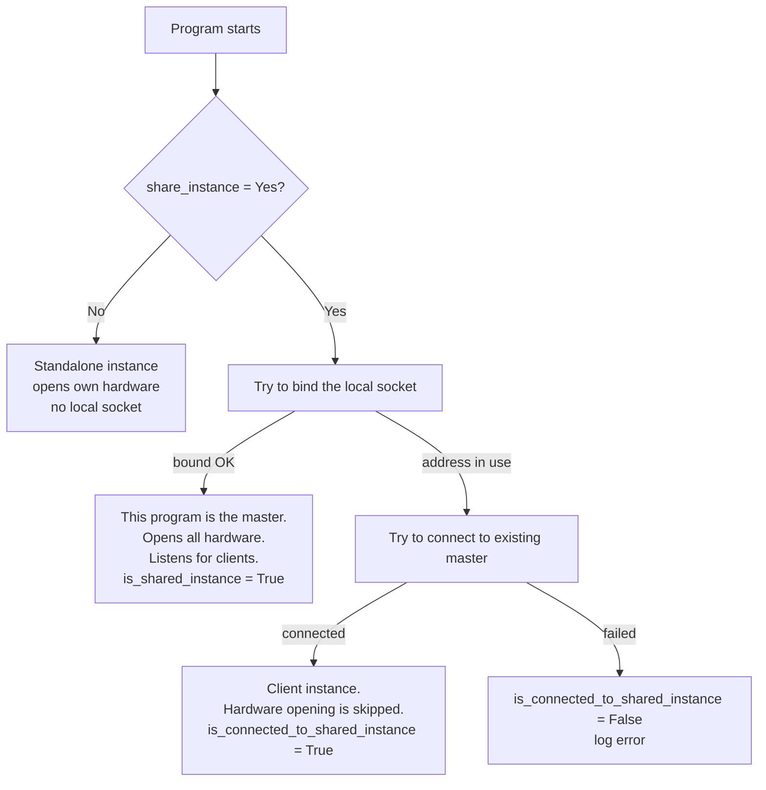

# Sharing a Reticulum Instance System-Wide

This document explains how to run a system-wide `rnsd` that all users on a machine can share, using `/etc/reticulum` as the shared config directory.

---

## How it works

Reticulum is a Python module, not a kernel driver. When any program calls `RNS.Reticulum()`, it looks for a running instance by trying to bind a local socket. The first program to start becomes the **master** — it opens all hardware interfaces and listens on a local socket. All subsequent Reticulum programs on the same machine detect that socket, skip opening hardware, and connect as lightweight clients.

```
┌─────────────────────────────────────────────────────┐
│  Host                                               │
│                                                     │
│   rnsd (master)        ←── data socket ──→  App A │
│   /etc/reticulum            ←── data socket ──→  App B│
│   opens radios                                       │
│                                                     │
│   rnstatus            ←── RPC socket (authed) ──→  App C│
└─────────────────────────────────────────────────────┘
```

On Linux and Android, the **data socket uses the AF_UNIX abstract namespace** — no file permissions involved, any local process can reach it. On other OSes, Reticulum falls back to TCP on loopback.

---

## The two sockets

Every shared instance exposes two sockets:

| Socket | Purpose | Linux / Android | Other OSes |
|---|---|---|---|
| **Data socket** | Reticulum packet traffic between master and clients | AF_UNIX abstract `\0rns/<instance_name>` | TCP `127.0.0.1:37428` |
| **RPC socket** | Management calls (`rnstatus`, `rnpath`, `rnprobe`, etc.) | AF_UNIX abstract `\0rns/<instance_name>/rpc` | TCP `127.0.0.1:37429` |

- The **data socket has no authentication**. Any local process can send/receive Reticulum packets. On Linux the abstract namespace is the access boundary.
- The **RPC socket is authenticated** with a pre-shared key (`authkey`). Programs like `rnstatus` must use the same key as the master or their calls are rejected.

---

## Config keys that matter

All in the `[reticulum]` section of `/etc/reticulum/config`:

| Key | Default | What it does |
|---|---|---|
| `share_instance` | `Yes` | Enables the shared-instance pattern. Keep on. |
| `instance_name` | `default` | Name used in the AF_UNIX abstract socket path. All programs sharing the instance must use the same name. |
| `shared_instance_type` | `unix` on Linux/Android, `tcp` elsewhere | `unix` uses AF_UNIX abstract sockets; `tcp` uses TCP on loopback. |
| `shared_instance_port` | `37428` | TCP port for data socket (only when `shared_instance_type = tcp`). |
| `instance_control_port` | `37429` | TCP port for RPC socket (only when `shared_instance_type = tcp`). |
| `rpc_key` | auto-derived | Pre-shared key for RPC authentication. By default computed from `/etc/reticulum/storage/transport_identity`. |

The `instance_name` must be consistent across all programs sharing the instance. Since `/etc/reticulum` is the single config directory for everyone, the auto-derived `rpc_key` is identical for all users automatically.

---

## The startup state machine

When `RNS.Reticulum()` is called, `__start_local_interface()` (`Reticulum.py` lines 375–438) works like this:



**A client never starts Transport.** Even if `enable_transport = Yes` is in the config, it is silently ignored on a client (lines 420–422 of `Reticulum.py`). Only the master runs Transport, responds to path requests, sends/receives on hardware, and persists path tables and identities.

Because every program tries to bind first, **whichever program starts first becomes the master** automatically — no election needed. If `rnsd` is started first, it wins. Any subsequent Reticulum program becomes a client.

---

## What gets stored in `/etc/reticulum/storage/`

```
storage/
├── transport_identity          # The node's long-term identity key. Created once.
│                             # Read-only after first start.
├── known_destinations        # All learned destination public keys (msgpack dict).
├── destination_table         # Known paths to other peers (msgpack list).
├── tunnels                   # Tunnel/relay table (msgpack).
├── packet_hashlist          # Packet deduplication set.
├── ratchets/                # Per-destination cryptographic ratchet state.
│   ├── <dest_hash1>
│   └── <dest_hash2>
├── cache/
│   ├── announces/           # Cached announce packets.
│   └── <packet_hash>        # Cached data packets.
└── resources/
    ├── <resource_hash>      # Downloaded/cached resource data.
    └── <resource_hash>.meta # Resource metadata.
```

Only the **master rnsd** reads and writes all of these. User programs are pure clients: they forward packets over the data socket and nothing else. This means there is no concurrency problem — one process writes, everyone else just passes packets.

---

## Concurrency safety

Reticulum uses two patterns to keep storage safe:

1. **Spin-wait flags**: before writing `destination_table`, `tunnels`, or `known_destinations`, the code checks a `saving_*` flag and waits up to 5 seconds for any previous write to finish. If it times out, the write is skipped rather than overwriting.
2. **Atomic rename**: ratchet state is written to a temp file then renamed over the final file with `os.replace()`. Readers always see a complete file, never a partial one.

| File | Pattern | Safe? |
|---|---|---|
| `known_destinations` | spin-wait + atomic rename on recombine | ✅ |
| `destination_table` | spin-wait flag; master only writes | ✅ |
| `tunnels` | spin-wait flag; master only writes | ✅ |
| `transport_identity` | created once, never rewritten | ✅ |
| Per-ratchet files | write-to-temp → `os.replace()` | ✅ |
| `cache/announces/` | plain `open("wb")` — no rename | ⚠️ non-fatal if corrupted |

The announce cache is the only file that could theoretically race, but corruption there is non-fatal — it is a performance cache, and the entry is simply discarded and re-fetched on next need.

---

## Setting up `/etc/reticulum`

### 1. Create the directory and install the config

```bash
sudo mkdir -p /etc/reticulum
sudo chown root:root /etc/reticulum
sudo chmod 755 /etc/reticulum
```

Generate a verbose example config to see all options:

```bash
rnsd --exampleconfig | sudo tee /etc/reticulum/config > /dev/null
```

Then edit `/etc/reticulum/config` with your actual interfaces and settings.

### 2. Create the `reticulum` system user

```bash
# Create the system user that runs rnsd (no login shell, no home needed)
sudo useradd -r -s /usr/sbin/nologin reticulum
```

### 3. Set ownership and permissions

All users on the system need full access to `/etc/reticulum` — read, write, and traverse. Running apps create files and subdirectories that must also be automatically accessible to everyone.

```bash
# /etc/reticulum and everything in it is fully accessible to everyone
# Capital X = execute only on dirs, not on files
sudo chmod -R ugo+rwX /etc/reticulum

# ACLs ensure new files/dirs inherit rwX for all automatically
sudo setfacl -R -m u::rwX /etc/reticulum
sudo setfacl -R -d -m u::rwX /etc/reticulum
sudo setfacl -R -d -m o::rwX /etc/reticulum
```

If `setfacl` is unavailable, the `chmod 777` achieves the same result (new files inherit based on `umask`).

The config file is world-readable:
```bash
sudo chmod 644 /etc/reticulum/config
```

On Linux, the AF_UNIX abstract socket gives all local users access to the data socket regardless of file permissions.

### 4. Install and configure the rnsd systemd service

Create `/etc/systemd/system/rnsd.service`:

```ini
[Unit]
Description=Reticulum Network Stack Daemon
After=multi-user.target

[Service]
Type=simple
Restart=always
RestartSec=3
User=reticulum
Group=reticulum
ExecStart=/usr/local/bin/rnsd --service

# Make sure the binary is accessible. If pip installed rnsd to a
# user-local path, symlink it into a directory in systemd's $PATH:
# sudo ln -s $(which rnsd) /usr/local/bin/

[Install]
WantedBy=multi-user.target
```

Enable and start:

```bash
sudo systemctl daemon-reload
sudo systemctl enable --now rnsd
```

### 5. Verify it works

As any user, check the status:

```bash
rnstatus
```

You should see:
- A line like `Shared Instance[default]` or `LocalInterface[37428]` with status `Up`.
- If Transport is enabled on the master, the interfaces (LoRa, TCP, etc.) will also appear.

If `rnstatus` hangs or prints `AuthenticationError`, check for a stray Python process that grabbed the socket first:

```bash
sudo ss -x | grep rns
# or on older systems:
sudo netstat -x | grep rns
kill <PID>
sudo systemctl restart rnsd
```

If you see `Started rnsd ... connected to another shared local instance`, that means another process became the master instead of rnsd — find and kill it.

---

## About the RPC key

The RPC socket uses a pre-shared key for authentication. By default Reticulum derives this key from the `transport_identity` file:

```python
rpc_key = SHA-256(Transport.identity.get_private_key())
```

Because all users share the same `/etc/reticulum`, they also share the same `transport_identity` and therefore the same default RPC key automatically. No explicit `rpc_key` setting is needed in this setup.

An explicit `rpc_key` would only be necessary if users were running with **different config directories**, because then each user's default key would be derived from a different `transport_identity`.

---

## Quick config reference

`/etc/reticulum/config`:

```ini
[reticulum]

enable_transport = Yes          # only on a stationary, always-on node

share_instance   = Yes         # keep this on — it's the point
instance_name    = default     # all users need the same name
shared_instance_type = unix   # Linux/Android default; omit on other OSes

[logging]
loglevel = 4                  # 0=critical .. 7=extreme

[interfaces]
  [[Default Interface]]
    type = AutoInterface
    interface_enabled = True
```

---

## Troubleshooting

| Symptom | Cause | Fix |
|---|---|---|
| `rnstatus` hangs or `AuthenticationError` | Stray Python process grabbed the socket | Kill stray processes, restart rnsd |
| `rnstatus` shows no interfaces | User's process became the master instead of rnsd | Kill stray Python processes, restart rnsd |
| `rnsd` fails to bind socket | Another `rnsd` already running | `systemctl stop rnsd` first |
| Users get "Permission denied" on storage | Storage not fully accessible to all | `sudo chmod -R 777 /etc/reticulum` |
| Programs open their own interfaces instead of connecting to rnsd | `share_instance = No` in config | Ensure it is `Yes` |
